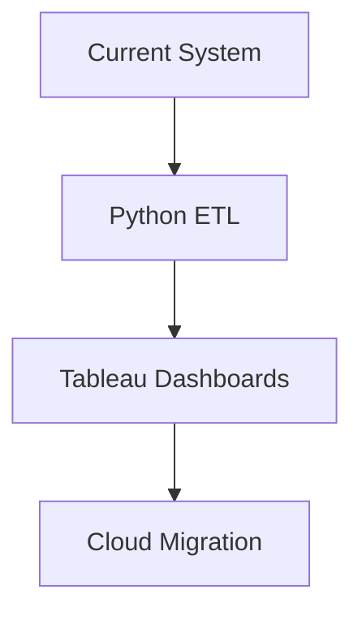

# Starlogic-CDR-Analytics 📡
 
 


A Telecom Analytics Solution developed to identify, track, and measure the use of a callback service for prepaid users with critically low airtime.

## 🌟 Overview
**Starlogic** is a telecom intelligence system that analyzes missed call triggers used by low-balance customers to prompt call-backs—transforming micro-interactions into measurable revenue streams.

## 🎯 Project Objective
To identify and analyze *intentional missed call triggers* by:
- Detecting flash calls (via `8850`-prefixed numbers)
- Validating response calls within 1 hour
- Tagging ON_NET/OFF_NET responses
- Calculating Minutes of Use (MoU) & Revenue
- Powering 80-20 revenue sharing with vendors

## 🧠 Business Logic
- **Eligibility:** Customers with ≤ ₦5 airtime
- **Trigger:** Call to `8850`-prefixed number
- **Validation:** Return call within 1 hour
- **Pairing:** Chronological proximity matching
- **Service:** Prepaid customers only

## 🛠️ Tech Stack
| Component | Technology |
|-----------|------------|
| Database | SQL (DB2 dialect) |
| ETL | Python (optional) |
| Reporting | Excel (.xlsx) |
| Automation | GitHub Actions |

## 📂 SQL Modules
```sql
-- Core Modules:
starlogic_onnet.sql    -- ON_NET return calls
starlogic_offnet.sql   -- OFF_NET responses
pairing_logic.sql      -- Call pairings
revenue_calculation.sql -- MoU & splits
```
## 📊 Key Metrics
| Metric | Description |
|--------|-------------|
| C1 | Total Triggered Calls |
| C2 | Unique Triggering Subs |
| C3 | Unique Receivers |
| C4-C5 | ON_NET Calls + Count |
| C6-C7 | OFF_NET Calls + Count |

## 🔄 Workflow
1. Daily CDR processing
2. Call pairing validation
3. Revenue calculation
4. Monthly Excel reporting:
   - Vendor payouts
   - Usage analysis
   - Compliance QA

## 🚀 Future Roadmap

## 🛠️ Installation
```
git clone https://github.com/yourusername/starlogic-cdr-analytics.git
cd starlogic-cdr-analytics/sql
# Execute in order:
# 1. create_tables.sql
# 2. starlogic_onnet.sql
# 3. starlogic_offnet.sql
# 4. da_usage_summary.sql
```
## 🤝 Contribution
PRs welcome! For major changes, please open an issue first.
## 👨‍💻 Author
**Olawale Falodun** 
